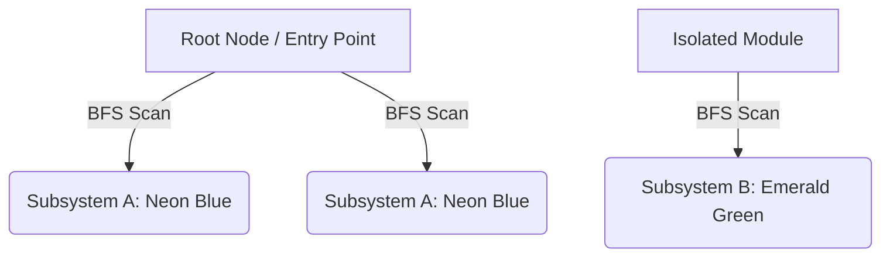

# GlideIt 🚀

<p align="center">
  
  
  
  
  
</p>

**GlideIt** is a premium static code mapping and architecture visualization tool designed to bridge the gap between source code structure and human intuition. By running a single command, GlideIt scans your repository (supporting Python and JavaScript/React JSX), parses the Abstract Syntax Trees (AST) using Tree-sitter, and generates a standalone, interactive, dependency-free interactive HTML application inside `glideit-out/`.

The visualization is entirely self-contained. It can be opened in any web browser with **zero internet connection** and **no local server required**!

---

## 🌟 Key Features

### 🔍 Advanced Abstract Syntax Tree (AST) Parsing
*   **Modular Extractor Pipeline**: Powered by a common `BaseExtractor` interface which wraps Tree-sitter parsing modules.
*   **Python Code Engine**:
    *   Extracts classes, function definitions, parameters (with type-hints), and return types.
    *   Identifies Flask routes (`@app.route`, `@blueprint.route`) and blueprinted controllers, establishing them as API entry-points.
    *   Traces local variable assignments and function invocations.
*   **React & JSX/TSX Code Engine**:
    *   Extracts functional and class-based React components.
    *   Constructs component render trees (parent-to-child component rendering).
    *   Hooks analyzer: Tracks usages of `useState`, `useEffect`, and custom hooks.
    *   HTTP client tracing: Inspects and documents `axios` and `fetch` calls.

### 🎨 Visual & Interactive Controls
*   **ELK.js Layout Engine**: Integrated with `@layout-elk/elkjs` to compute layered, crossing-free hierarchical layouts.
*   **Layout Direction Toggle**: Instantly re-run the layout engine to switch between Top-to-Bottom (`TB`) and Left-to-Right (`LR`) orientations.
*   **Execution Depth Slider**: Filter nodes dynamically by their depth (e.g. show only entry-points at depth 0, or slide to reveal deeply nested utility functions).
*   **Breadcrumb Trace Indicator**: Hovering over any node dynamically runs a backtrack algorithm to compute and display the complete call sequence from the root entry-points down to that node.
*   **Subsystem Grouping & Palette**: Employs a BFS-based partition algorithm that automatically colors codebase clusters with a premium neon/pastel palette (Neon Blue, Emerald Green, Indigo Purple, Amber Gold, Rose Pink, Ocean Teal, Coral Red).
*   **Focused Highlight & Dimming**: Selecting a node applies a glowing shadow matching its subsystem's theme color, keeps its direct dependents fully opaque, dims all unrelated nodes (`0.35` opacity) and edges (`0.1` opacity), and animates flow direction with moving dots.
*   **Advanced Navigation Keybindings**:
    *   Hold `Space` + drag to pan the canvas smoothly.
    *   Arrow keys to pan the canvas in small increments.
    *   `Ctrl + Shift + F` to fit the whole graph to the screen.
    *   `?` key to slide open the interactive **Legend Panel & Shortcut Reference** panel.

---

## 🔬 Architectural & Algorithmic Deep Dives

To handle large codebases without turning into an unreadable "spaghetti graph," GlideIt implements several custom algorithms:

### 1. Layered Graph Organization (ELK.js)
Traditional force-directed graphs (e.g., d3-force) often cause nodes to cluster into circular, chaotic webs. GlideIt implements a layered algorithm via ELK.js:
*   Nodes are categorized into layers based on their calculated **call depth**.
*   The layout is calculated using the `layered` algorithm, ensuring edges flow unidirectionally (left-to-right or top-to-bottom) and node overlaps are mathematically prevented.

### 2. BFS Subsystem Clustering
GlideIt analyzes the topology of the call graph to isolate independent subsystems:
$$\text{Clusters} = \text{ConnectedComponents}(G)$$
Using a Breadth-First Search (BFS) traversal, the graph is split into isolated component subgraphs. Each subgraph is assigned a unique HSL color index, making it immediately clear which modules are decoupled from the rest of the application.



### 3. Back-Trace Path Generation (Breadcrumbs)
When you hover over a node, GlideIt traces its ancestors back to the origin:
1.  It initiates a search back through incoming edges.
2.  It traverses upward until it hits a node with `depth: 0` (Flask route or React page component).
3.  It structures this path into a beautiful breadcrumb component showing the complete sequence, e.g. `auth.py:login ➔ user.py:get_user ➔ db.py:query`.

---

## 📂 Project Structure

```text
glideit/
├── glideit/                  # Python CLI package
│   ├── __init__.py
│   ├── cli.py                # Command-line interface & custom threaded web server
│   ├── walker.py             # Gitignore-aware project file scanner
│   ├── graph.py              # Graph assembler & JSON serializer
│   └── extractors/           # Language AST extractors
│       ├── __init__.py
│       ├── base.py           # Common base extractor class
│       ├── python_extractor.py
│       └── jsx_extractor.py
├── renderer/                 # React + Vite visualization client
│   ├── package.json          # Node dependencies including elkjs and xyflow
│   ├── vite.config.js
│   ├── index.html
│   └── src/
│       ├── main.jsx
│       ├── App.jsx
│       ├── layout.js         # ELK-based node/edge layout utility
│       ├── clusterColors.js  # Curated palette for subsystems
│       ├── components/
│       │   ├── Navbar.jsx
│       │   ├── CanvasToolbar.jsx  # Depth slider + layout orientation toggle
│       │   ├── LegendPanel.jsx    # Visual legend + shortcuts lookup
│       │   ├── BreadcrumbBar.jsx  # Hover-based trace indicator
│       │   ├── CodeFlowPage.jsx
│       │   ├── ApiPage.jsx
│       │   └── JsxPage.jsx
│       ├── hooks/
│       │   ├── useKeyBindings.js  # Global shortcut listeners
│       │   └── useSpacePan.js     # Spacebar pan controller
│       ├── utils/
│       │   └── findPathToRoot.js  # BFS back-trace path resolver
│       └── styles/
│           └── index.css     # Premium dark mode stylesheet
├── pyproject.toml            # Poetry/PIP build definition
└── README.md                 # Project documentation
```

---

## 🛠️ Installation & Setup

### Python Package Installation
To install GlideIt locally for development, clone the repository and run:
```bash
pip install -e .
```

### Frontend Development Setup
To run the React renderer locally during development:
1. Navigate to the renderer directory:
   ```bash
   cd renderer
   ```
2. Install npm dependencies:
   ```bash
   npm install
   ```
3. Launch the Vite local dev server:
   ```bash
   npm run dev
   ```

---

## 💻 CLI Usage

Once installed, GlideIt exposes two primary subcommands: `run` and `serve`.

### 1. Run Pipeline (`glideit run`)
Parses the target repository, builds the Vite production application, compiles the React renderer, and outputs a standalone visualization package.
```bash
glideit run [options]
```

**Options**:
*   `--output <dir>`: Custom destination for the visualization bundle (defaults to `glideit-out/`).
*   `--single`: Bundle the visualizer as a single, self-contained HTML file containing the JSON data.
*   `--serve`: Runs the parser, bundles the site, and immediately runs a local preview server.
*   `--exclude <patterns...>`: Glob patterns to exclude from scanning (e.g. `--exclude tests/ migrations/ "**/__pycache__"`).
*   `--help`: Details usage and flags.

### 2. Preview Server (`glideit serve`)
Starts a local web server to serve the already generated `glideit-out/` visualization bundle *without* re-parsing the codebase.
```bash
glideit serve [options]
```

**Options**:
*   `--port <number>`: Port to bind the server to (defaults to `8000`).

*Note: The built-in server runs on a background thread so it can be terminated cleanly at any time using `Ctrl+C` on Windows.*

---

## 🎮 Shortcuts Cheat Sheet

| Keybinding | Action |
|---|---|
| `Space` + Drag | Pan canvas freely without selecting or moving nodes |
| `Arrow Keys` | Pan the viewport in small increments |
| `Ctrl + Shift + F` | Fit the entire graph to the screen |
| `?` | Toggle the Legend Panel & Shortcuts Reference |
| `Escape` | Reset current node selection and remove highlights |
| `Double Click Node` | Toggle node expansion to view parameters, return types, or docstrings |
