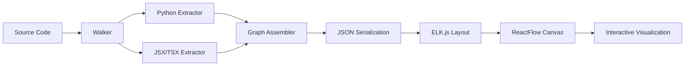

<p align="center">
  
</p>

<p align="center">
  
</p>


<p align="center">
  
  
  
  
  
  
</p>

<p align="center">
  <b>✨ From source code to interactive architecture graphs — in one command.</b>
  <br/>
  GlideIt scans your Python & React/JSX codebase, parses it with <b>Tree-sitter</b>, and generates a<br/>
  <b>standalone, offline-capable, interactive HTML visualization</b> — no server required.
</p>

<br/>

---

## Quick Start

```bash
# Install
pip install glideit

# Visualize your codebase
glideit run

# Open the interactive graph
glideit serve

# (Optional) Inject GlideIt docstring skill into your AI coding agents
glideit init
```

Open `http://localhost:8000` and explore your codebase visually.

---

## The Problem

Codebases grow. Dependencies tangle. After a few months, nobody knows what calls what.

Traditional solutions don't help:
- **File trees** (`ls -R`, `tree`) show structure, not relationships
- **Documentation** goes stale the moment it's written
- **Force-directed graphs** devolve into chaotic hairballs
- **Static analysis** tools produce raw dumps, not insight

**GlideIt solves this** by combining production-grade AST parsing with a beautiful, interactive graph renderer that gives you multiple ways to navigate your code.

---

## Features

### 🔍 AST-Powered Extraction

| Language | Capabilities |
|---|---|
| **Python** | Functions, classes, parameters (with type hints), return types, Flask routes (`@app.route`, `@blueprint.route`), import resolution, call graph construction |
| **React/JSX/TSX** | Functional & class components, props, hooks (`useState`, `useEffect`, custom hooks), JSX render trees, `fetch()`/`axios` tracing |

Both powered by a shared `BaseExtractor` interface wrapping **Tree-sitter** parsers for speed and correctness.

### 🎨 Three Visualization Modes

| Page | What it shows |
|---|---|
| **Code Flow** | Full function-level call graph with classes, Flask routes, and external calls |
| **API Routes** | Card-based view of all Flask endpoints, grouped by blueprint, with HTTP methods, parameters, and call chains |
| **JSX Components** | React component tree — parent-child render relationships with hooks and API calls |

### 🕹️ Interactive Canvas Controls

| Feature | Description |
|---|---|
| **ELK.js Layered Layout** | Hierarchical, crossing-minimized layouts — not chaotic force-directed graphs |
| **Layout Direction** | Toggle between top-to-bottom and left-to-right with a single click or `L` key |
| **Depth Slider** | Filter nodes dynamically by call depth — show only entry points or drill into deep utility functions |
| **Breadcrumb Trace** | Hover any node to see its full call chain from entry point, displayed as a pill-shaped trail |
| **Subsystem Clustering** | BFS-based partitioning auto-colors disconnected modules with a premium neon/pastel palette |
| **Focus Highlight** | Click a node to glow-highlight it, keep its dependencies fully opaque, dim everything else |
| **Smart Focal Zoom** | On load, automatically zooms to the `main()` function or top-level React root component |
| **Minimap** | Always-visible overview for large graphs — toggle with `M` |
| **Legend Panel** | Slide-open reference showing node types, edge styles, and every keyboard shortcut |
| **Graph Archiving** | Snapshot your graph and seamlessly switch between historical graphs via the UI dropdown |

### ⌨️ Keyboard Shortcuts

| Key | Action |
|---|---|
| `Space` + drag | Pan canvas |
| `Arrow keys` | Pan viewport |
| `Ctrl + Shift + F` | Fit entire graph to screen |
| `?` | Toggle legend & shortcuts panel |
| `Esc` | Deselect / reset highlights |
| `Shift` + click | Lock breadcrumb trail |
| `M` | Toggle minimap |
| `L` | Toggle layout direction |
| `Ctrl + Home` | Jump to entry points |

### 📦 Output Modes

| Mode | Command | Output |
|---|---|---|
| **Multi-file** | `glideit run` | `glideit-out/` folder with `graph-data.json` + static assets |
| **Single-file** | `glideit run --single` | One self-contained `index.html` with inline graph data |
| **Auto-serve** | `glideit run --serve` | Parse, build, and launch preview server in one step |

Every output is **fully offline** — open `index.html` directly from disk with zero dependencies, no network, no server.

### 🤖 AI Agent Integration

GlideIt now includes a built-in interactive installer to inject the `glideit-docstring` skill into your favorite AI coding agents (Claude Code, Cursor, Windsurf, Copilot, Cline, RooCode, and 14 others). This skill provides guidelines for agents to generate precise, high-quality docstrings across your codebase. Just run `glideit init`!

---

## Architecture

### Data Pipeline



### Graph Assembly Algorithm

1. **Extraction**: Each file is parsed with Tree-sitter into a language-specific AST
2. **Merging**: `GraphAssembler` deduplicates nodes, resolves cross-file references via import maps, normalizes paths
3. **Depth Computation**: BFS from entry points (Flask routes, React roots, `main()` functions) assigns every node a call depth
4. **Cycle Detection**: Iterative DFS marks circular edges so they're visually distinct
5. **Clustering**: Connected-components algorithm partitions the graph into isolated subsystems, each assigned a unique color from a curated palette
6. **Stub Resolution**: Import-only references are resolved to their actual definitions, duplicate stubs are pruned
7. **Layout**: ELK.js `layered` algorithm computes crossing-minimized, hierarchical positions
8. **Rendering**: ReactFlow renders the graph with custom node/edge components, breadcrumbs, and interaction handlers

### Back-Trace Path Generation (Breadcrumbs)

When hovering a node, `findPathToRoot.js` traces backwards through incoming edges using BFS until it hits a depth-0 entry point, producing a chain like:

```
auth.py:login ➔ user.py:get_user ➔ db.py:query
```

Each breadcrumb element is clickable to center the viewport on that node.

---

## CLI Reference

### `glideit run`

Parse a codebase and produce the visual output.

```bash
glideit run [repo_root] [options]
```

| Option | Description |
|---|---|
| `repo_root` | Path to repository (default: `.`) |
| `--output, -o <dir>` | Output directory (default: `glideit-out/`) |
| `--single` | Bundle as single self-contained HTML |
| `--serve, -s` | Parse, build, and auto-launch preview server |
| `--exclude <patterns...>` | Glob patterns to exclude (e.g. `--exclude tests/ "**/migrations"`) |

### `glideit serve`

Serve an already-generated visualization without re-parsing.

```bash
glideit serve [directory] [options]
```

| Option | Description |
|---|---|
| `directory` | Output directory to serve (default: `glideit-out/`) |
| `--port, -p <number>` | Port to bind (default: `8000`, auto-increments if busy) |

### `glideit archive`

Snapshot the current visualization graph into a persistent archive. You can view, load, and delete these archives directly from the frontend UI dropdown in the navbar.

```bash
glideit archive [options]
```

| Option | Description |
|---|---|
| `--output, -o <dir>` | Output directory where graphs are stored (default: `glideit-out/`) |
| `--name <label>` | Optional label for the archive; auto-generates a fun name if omitted |

### `glideit init`

Interactively select AI coding agents installed on your system and inject the GlideIt docstring skill into them.

```bash
glideit init [repo_root] [options]
```

| Option | Description |
|---|---|
| `repo_root` | Path to the workspace root (default: current directory) |
| `--update` | Update the skill for agents where it is already installed |

### Examples

```bash
# Basic usage
glideit run
glideit serve

# Single-file portable output
glideit run --single

# Custom output location
glideit run ../my-project --output ./visuals

# Exclude test directories
glideit run --exclude tests/ "**/__pycache__" migrations/

# Serve existing output on a specific port
glideit serve --port 3000

# Archive current graph
glideit archive --name pre-refactor

# Inject AI agent skills
glideit init
```

---

## Installation

### From PyPI (recommended)

```bash
pip install glideit
```

### From source

```bash
git clone https://github.com/abhishekmohite55/GlideIt.git
cd GlideIt
pip install -e .
```

### Frontend development

```bash
cd glideit/renderer
npm install
npm run dev     # Vite HMR dev server
```

---

## Tech Stack

| Layer | Technology |
|---|---|
| **Parser** | Tree-sitter (Python, JavaScript, TypeScript grammars) |
| **Backend** | Python 3.9+ with stdlib HTTP server |
| **Graph Engine** | ELK.js (`layered` algorithm via Web Worker) |
| **Frontend** | React 18 + Vite 5 |
| **Canvas** | ReactFlow (@xyflow/react) |
| **Styling** | Premium dark mode CSS (custom properties, backdrop-filter glassmorphism) |

---

## Why ELK.js?

Force-directed layouts (d3-force) produce chaotic, overlapping graphs with long edge crossings — they look pretty but communicate little.

ELK.js implements the **Kieler ELK layered algorithm**, which:
- Places nodes in ranked layers by topological order
- Minimizes edge crossings with Layer Sweep + Brandes/Köpf strategies
- Routes edges orthogonally (right-angle bends)
- Respects hierarchical priorities (entry points float to top)

The result: a clean, readable architecture diagram that actually helps you understand the codebase.

---

## Contributing

Contributions are welcome! See [CONTRIBUTING.md](./CONTRIBUTING.md) for guidelines.

## Changelog

See [CHANGELOG.md](./CHANGELOG.md) for version history.

---

<p align="center">
  <b>GlideIt</b> — Turn code into architecture.<br/>
  <a href="https://github.com/abhishekmohite55/GlideIt">GitHub</a> &nbsp;·&nbsp;
  <a href="https://github.com/abhishekmohite55/GlideIt/issues">Report a bug</a> &nbsp;·&nbsp;
  MIT License
</p>
